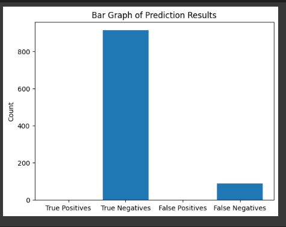

<a href="https://github.com/drshahizan/SECP3843/stargazers"></a>
<a href="https://github.com/drshahizan/SECP3843/network/members"></a>
<a href="https://github.com/drshahizan/SECP3843/pulls"></a>
<a href="https://github.com/drshahizan/SECP3843/issues"></a>
<a href="https://github.com/drshahizan/SECP3843/graphs/contributors"></a>


Don't forget to hit the :star: if you like this repo.

# Special Topic Data Engineering (SECP3843): Alternative Assessment

#### Name: Adrina Asyiqin Binti Md Adha
#### Matric No.: A20EC0174
#### Dataset: sales.json

## Question 4 

### Choosing An Appropriate Machine Learning And How To Use It

### Step 1: Data Cleaning
- In this part, I execute all code in Google Colab
- Firstly , load sales.json data from mongodb
  ```py
  # Connect to MongoDB and retrieve data
  !pip install pymongo
  import pymongo
  import pandas as pd

  # Connect to MongoDB and retrieve data
  password = "Adrina857600"
  client = pymongo.MongoClient("mongodb+srv://cluster0.yvk5zzq.mongodb.net/", username="adrinaasyiqin", password=password)
  db = client["salesdatabase"]
  collection = db["salessample"]
  data = list(collection.find())

  # Convert to dataframe
  df = pd.DataFrame(data)

  # Check the DataFrame
  print(df.head())
  df.info()
  ```
  
- Data cleaning and preparation. Some of the data cleaning I did is `handling missing values`,`removing duplicates`, and `convert items column into seperate columns`

  ```py
  #split customer and items columns, where dict data into appropriate values and columns
  import numpy as np

  df['satisfaction'] = df['customer'].apply(lambda x: x['satisfaction'] if pd.notnull(x) else np.nan)
  df['gender'] = df['customer'].apply(lambda x: x['gender'] if pd.notnull(x) else np.nan)  
  df['email'] = df['customer'].apply(lambda x: x['email'] if pd.notnull(x) else np.nan)
  df['age'] = df['customer'].apply(lambda x: x['age'] if pd.notnull(x) else np.nan) 
  
  df.drop('customer', axis=1, inplace=True)

  df['item_names'] = df['items'].apply(lambda x: [item['name'] for item in x] if isinstance(x, list) else [])
  df['item_tags'] = df['items'].apply(lambda x: [item['tags'] for item in x] if isinstance(x, list) else [])
  df['item_prices'] = df['items'].apply(lambda x: [item['price'] for item in x] if isinstance(x, list) else [])
  df['item_quantities'] = df['items'].apply(lambda x: [item['quantity'] for item in x] if isinstance(x, list) else [])

  df.drop('items', axis=1, inplace=True)

  df.head()
  ```

  


  ```py
  #clean data
  df.isnull().sum()

  df.dropna(inplace=True)

  df["couponUsed"] = df["couponUsed"].astype(bool)

  df.info()
  ```

  


### Step 2: Data Visualisation
- Create bar graph
  ```py
  import matplotlib.pyplot as plt

  # Count the number of sales by store location
  sales_by_location = df['storeLocation'].value_counts()

  # Create a bar chart
  plt.figure(figsize=(10, 6))
  plt.bar(sales_by_location.index, sales_by_location.values)

  plt.xlabel('Store Location')
  plt.ylabel('Number of Sales')
  
  plt.title('Sales Distribution by Store Location')
  plt.xticks(rotation=45)
  plt.show()

  ```

  


- Create pie chart
  ```py
  import matplotlib.pyplot as plt

  # Count the number of sales by purchase method
  sales_by_purchase_method = df['purchaseMethod'].value_counts()

  # Create a pie chart
  plt.figure(figsize=(8, 8))
  plt.pie(sales_by_purchase_method.values, labels=sales_by_purchase_method.index, autopct='%1.1f%%', startangle=90)
  plt.axis('equal')
  plt.title('Sales Distribution by Purchase Method')
  plt.show()

  ```

  


### Step 3: Macbine Learning

1. The code prints the accuracy of the model on the test set. The accuracy value indicates how well the model performed in predicting coupon usage. A higher accuracy value suggests that the model made more correct predictions. However, it's important to consider other evaluation metrics and the specific requirements of the task to fully assess the model's performance.
  ```py
  import pandas as pd
  from sklearn.model_selection import train_test_split
  from sklearn.ensemble import RandomForestClassifier
  from sklearn.metrics import accuracy_score
  from sklearn.preprocessing import LabelEncoder
  # Step 1: Load the dataset
  data = df.drop(columns=['age','email','satisfaction','saleDate','item_names','item_tags','item_prices','item_quantities'])

  # Step 2: Preprocessing
  label_encoder = LabelEncoder()
  data["storeLocation"] = label_encoder.fit_transform(data["storeLocation"])
  data["purchaseMethod"] = label_encoder.fit_transform(data["purchaseMethod"])
  data["gender"] = label_encoder.fit_transform(data["gender"])

  # Step 3: Splitting the data into train and test sets
  X = data.drop(["couponUsed"], axis=1)
  y = data["couponUsed"]
  X_train, X_test, y_train, y_test = train_test_split(X, y, test_size=0.2, random_state=42)

  # Step 4: Selecting a model and training
  model = RandomForestClassifier()
  model.fit(X_train, y_train)

  # Step 5: Evaluating the model
  y_pred = model.predict(X_test)
  accuracy = accuracy_score(y_test, y_pred)
  print("Accuracy:", accuracy)
  ```

  


2. The accuracy of the model is calculated using the accuracy_score function from scikit-learn. It compares the predicted coupon usage labels (y_pred) with the actual labels from the test set (y_test). The accuracy represents the proportion of correctly predicted instances out of the total instances in the test set.
   - The resulting bar graph visually represents the accuracy of the machine learning model in predicting coupon usage. The height of the bar represents the accuracy value, indicating how well the model performed. By examining the bar's height, you can quickly determine the accuracy score of the model.
  ```py
  import matplotlib.pyplot as plt

  # Calculate the accuracy of the model
  accuracy = accuracy_score(y_test, y_pred)

  # Create a bar graph
  plt.bar(["Accuracy"], [accuracy])
  plt.ylim(0, 1)  # Set the y-axis limit from 0 to 1
  plt.ylabel("Accuracy")  # Label for the y-axis
  plt.title("Model Accuracy")  # Title of the graph

  # Display the graph
  plt.show()

  ```

  

3. The provided code generates a bar graph to visualize the counts of true positives, true negatives, false positives, and false negatives in the prediction results.
   - The resulting bar graph visually represents the counts of true positives, true negatives, false positives, and false negatives in the prediction results. Each bar represents the count of a specific category, providing insights into the model's performance in predicting coupon usage. By examining the heights of the bars, we can compare the number of correctly and incorrectly predicted instances for each category.
   - This visualization helps in understanding the model's performance in differentiating between coupon used and not used instances. It provides a more detailed perspective beyond overall accuracy and can be useful for assessing the model's strengths and weaknesses in specific prediction categories.

  ```py
  import matplotlib.pyplot as plt  

  # Calculate the number of true positives, true negatives, false positives, and false negatives
  tp = ((y_pred == 1) & (y_test == 1)).sum()
  tn = ((y_pred == 0) & (y_test == 0)).sum()
  fp = ((y_pred == 1) & (y_test == 0)).sum()
  fn = ((y_pred == 0) & (y_test == 1)).sum()

  # Create a bar graph
  labels = ['True Positives', 'True Negatives', 'False Positives', 'False Negatives']
  values = [tp, tn, fp, fn]
  plt.bar(labels, values)
  plt.ylabel('Count')
  plt.title('Bar Graph of Prediction Results')

  # Display the bar graph
  plt.show()

  ```

  
  


  

## Contribution 🛠️
Please create an [Issue](https://github.com/drshahizan/special-topic-data-engineering/issues) for any improvements, suggestions or errors in the content.

You can also contact me using [Linkedin](https://www.linkedin.com/in/drshahizan/) for any other queries or feedback.

[](https://visitorbadge.io/status?path=https%3A%2F%2Fgithub.com%2Fdrshahizan)

