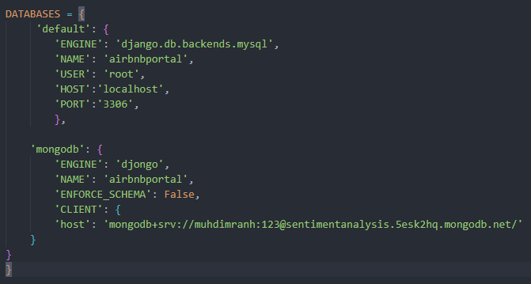
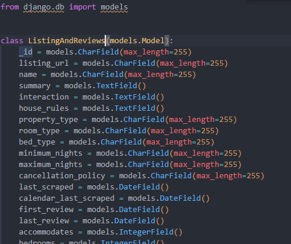
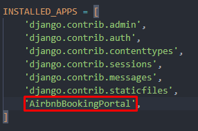
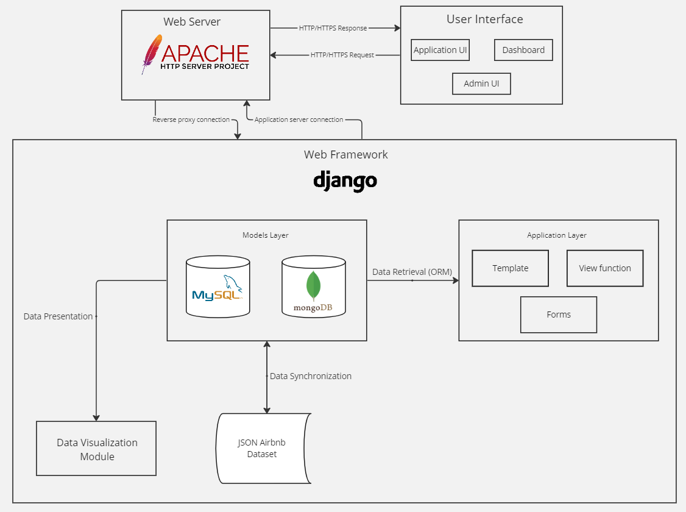

<a href="https://github.com/drshahizan/SECP3843/stargazers"></a>
<a href="https://github.com/drshahizan/SECP3843/network/members"></a>
<a href="https://github.com/drshahizan/SECP3843/pulls"></a>
<a href="https://github.com/drshahizan/SECP3843/issues"></a>
<a href="https://github.com/drshahizan/SECP3843/graphs/contributors"></a>


Don't forget to hit the :star: if you like this repo.

# Special Topic Data Engineering (SECP3843): Alternative Assessment

#### Name: MUHAMMAD IMRAN HAKIMI BIN MOHD SHUKRI
#### Matric No.:A20EC0213
#### Dataset:AIRBNB

## Question 1 (a)

To integrate Django with the JSON dataset and ensure efficient data storage and retrieval from both MySQL and MongoDB databases for Airbnb Booking Portal, there are numbers steps need to be followed:

### 1. **Install Django**
Start by installing Django by using the pip package manager to install Django. Use `python -m pip install Django`.


### 2. **Set up Django project**
Create a new Django project using the `django-admin startproject` command. This will create a project directory with the necessary files and folders.


### 3. **Create Django app**
Inside the project directory, create a new Django app using the `python manage.py startapp` command. This will create an app directory with the required files for the app.


### 4. **Configure the settings**
Open the settings.py file in the project directory and configure the database settings for both MySQL and MongoDB. Set the "DATABASES" dictionary to include the necessary configuration for MySQL and MongoDB databases. 

In this approach, I will be using the djongo library to connect to MongoDB. To add MongoDB and MySQL as database:


a. Install djongo using `pip install djongo` and mysqlclient using `pip install mysqlclient`.


b. Modify the "DATABASES" library as the following:

```
MongoDB: `DATABASES = {
        'default': {
            'ENGINE': 'djongo',
            'NAME': 'your-db-name',
            'ENFORCE_SCHEMA': False,
            'CLIENT': {
                'host': 'mongodb+srv://<username>:<password>@<atlas cluster>/<myFirstDatabase>?retryWrites=true&w=majority'
            }  
        }
}

MySQL: `DATABASES = {
	'default': {
		'ENGINE': 'django.db.backends.mysql',
		'NAME': 'mydb',
		'USER': 'root',
		'PASSWORD': 'admin',
		'HOST':'localhost',
		'PORT':'3306',
	}
}
```

c. To use both, here is an example of how I implement it in my settings.py:



### 5. **Define models**

In Django, models represent the structure of the data. Define models in the models.py file of the app to reflect the schema of the JSON dataset. Each model class should correspond to a table in the databases. Below is how can I write based on my dataset.



### 6. **Migrate the database**
Run the `python manage.py makemigrations` command to create the necessary database migrations based on the defined models. Then, run the `python manage.py migrate` command to apply these migrations and create the corresponding tables in both MySQL and MongoDB.

Before applying migration, make sure in the settings.py, in INSTALLED_APPS, your application name is written.




Pictures below show how migration is made towards MySQL.


### 7. **Load data from JSON**
Write a script or a Django management command to read the JSON dataset (listingsAndReviews.json) and populate the tables in both databases. I will use the Django ORM to interact with the databases and insert the data.

### 8. **Querying and retrieving data**
Use Django's ORM to query and retrieve data from both databases. This can be done by writing queries and perform operations on the model to fetch the required data. For example, if i want to load anything from my dataset, I can use the retrieval query as below.


### 9. **Update and synchronization**
If the JSON dataset is updated or new data is added, I will need to update the databases accordingly.

### 10. **Test and optimize**
Test the integration thoroughly to ensure that data is stored and retrieved correctly from both MySQL and MongoDB. Optimize the queries and database operations for better performance, considering factors such as indexes and query optimization techniques.

From all the steps above, there are some steps that I may skip in case I already have the airbnb datasets populated in my MongoDB database. In this case, I can skip loading data from JSON (step 7).


## Question 1 (b)



### 1. User Interface (Application UI, Admin UI, Dashboard):

- This is the interface through which users interact with the application. It sends HTTP/HTTPS requests to the web server.
- The User Interface (UI) sends HTTP requests to the Web Server (Apache) when a user interacts with the web application.
- These requests can include actions like submitting a form, clicking a button, or navigating to a specific URL.


### 2. Web Server (Apache):

Apache is a widely used open-source web server that can be used to serve Django applications. It acts as the communication bridge between the client's web browser and the Django application. Apache is responsible for handling the HTTP/HTTPS requests and responses, as well as managing the secure communication through HTTPS.

- The Web Server (Apache) receives the HTTP requests from the User Interface (UI).
- It processes these requests and generates HTTP responses.
- The generated responses contain the requested data or instructions for the User Interface (UI) to display or perform certain actions.
- The Web Server (Apache) sends these HTTP responses back to the User Interface (UI).

### 3. Web Framework (Django)

Django is a web framework that acts as the central hub of the application. It handles incoming HTTP/HTTPS requests from the user interface and provides a set of tools and functionality to build web applications.

- The Web Server (Apache) acts as an intermediary between the User Interface (UI) and the Web Framework (Django).
- When the Web Server (Apache) receives an HTTP request, it forwards the request to the appropriate Web Framework (Django) application.
- The Web Framework (Django) processes the request, performs the necessary computations, retrieves data from a database if needed, and generates an appropriate HTTP response.
- The Web Framework (Django) then sends the HTTP response back to the Web Server (Apache).

### 4. Application Layer:

Includes forms, template and view function responsible for handling requests and generating responses. Communicates with the models layer and retrieves data for presentation.

### 5. Models Layer:

Represents the database layer of the application. Consists of two databases: MySQL DB and MongoDB. Stores and retrieves data using Django's ORM (Object-Relational Mapping). By including bidirectional arrows between the Models Layer and JSON Datasets components, I indicate that data synchronization can occur in both directions. This means that updates made in the models layer can be reflected in the JSON datasets, and vice versa. This ensures data synchronization.

### 6. JSON Datasets:

Contains the dataset the Airbnb dataset provided for analysis. These datasets serve as a source of data for the application.

### 7. Data Synchronization:

Involves the synchronization of data between the models layer (databases) and the JSON datasets. Ensures that the data remains consistent and up to date in both storage options.

### 8. Data Presentation:

Involves the generation of visualizations and the presentation of data to the user. This component includes the dashboard and visualization modules.


## Contribution 🛠️
Please create an [Issue](https://github.com/drshahizan/special-topic-data-engineering/issues) for any improvements, suggestions or errors in the content.

You can also contact me using [Linkedin](https://www.linkedin.com/in/drshahizan/) for any other queries or feedback.

[](https://visitorbadge.io/status?path=https%3A%2F%2Fgithub.com%2Fdrshahizan)


