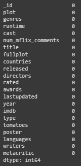

<a href="https://github.com/drshahizan/SECP3843/stargazers"></a>
<a href="https://github.com/drshahizan/SECP3843/network/members"></a>
<a href="https://github.com/drshahizan/SECP3843/pulls"></a>
<a href="https://github.com/drshahizan/SECP3843/issues"></a>
<a href="https://github.com/drshahizan/SECP3843/graphs/contributors"></a>


Don't forget to hit the :star: if you like this repo.
# Special Topic Data Engineering (SECP3843): Alternative Assessment

#### Name: Luqman Ariff Bin Noor Azhar
#### Matric No.: A20EC0202
#### Dataset: 03 - Movies

## Question 4 
Import the necessary libraries
```python
import pandas as pd
import pymongo
import json
```
Retrieve the data and put into a dataframe
```python
client = pymongo.MongoClient("mongodb://localhost:27017/")
db = client["mflix"]
collection = db["movies"]

data = list(collection.find())
df = pd.DataFrame(data)
```
Removing nulls
```python
df = df.dropna()
df.isnull().sum()
```


Import libraries for machine learning
```python
from sklearn.model_selection import train_test_split
from sklearn.linear_model import LinearRegression
from sklearn.metrics import mean_squared_error
```
Prepare the data 
```python
imdb_rating = df['imdb'].apply(lambda x: float(x.get('rating', {}).get('$numberDouble', 0)))
viewer_rating = df['tomatoes'].apply(lambda x: float(x.get('viewer', {}).get('rating', {}).get('$numberDouble', 0)))
```
Split the data and train the model
```python
X_train, X_test, y_train, y_test = train_test_split(imdb_rating, viewer_rating, test_size=0.2, random_state=42)
model = LinearRegression()

model.fit(X_train.values.reshape(-1, 1), y_train.values.reshape(-1, 1))

# Make predictions
y_pred = model.predict(X_test.values.reshape(-1, 1))

# Evaluate the model
mse = mean_squared_error(y_test, y_pred)
r_squared = model.score(X_test.values.reshape(-1, 1), y_test.values.reshape(-1, 1))

print("Mean Squared Error:", mse)
print("R-squared:", r_squared)
```


Visualize the result
```python
import matplotlib.pyplot as plt
import numpy as np

coefficients = np.polyfit(imdb_rating, viewer_rating, 1)
p = np.poly1d(coefficients)
trend_line = np.linspace(min(imdb_rating), max(imdb_rating), 100)

# Plotting the scatter plot
plt.scatter(imdb_rating, viewer_rating)
plt.xlabel('IMDb Rating')
plt.ylabel('Tomatoes Viewer Rating')
plt.title('IMDb Rating vs Tomatoes Viewer Rating')
plt.plot(trend_line, p(trend_line), color='r', label='Trend Line')


# Displaying the plot
plt.show()
```


## Contribution 🛠️
Please create an [Issue](https://github.com/drshahizan/special-topic-data-engineering/issues) for any improvements, suggestions or errors in the content.

You can also contact me using [Linkedin](https://www.linkedin.com/in/drshahizan/) for any other queries or feedback.

[](https://visitorbadge.io/status?path=https%3A%2F%2Fgithub.com%2Fdrshahizan)

