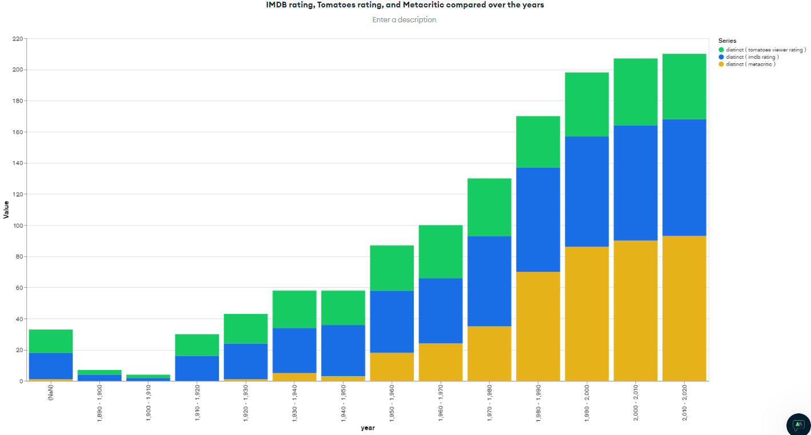
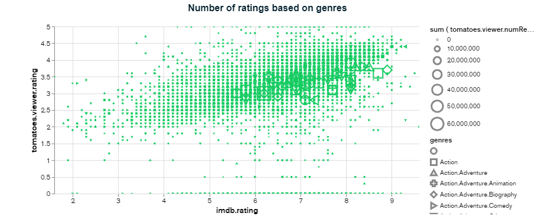

<a href="https://github.com/drshahizan/SECP3843/stargazers"></a>
<a href="https://github.com/drshahizan/SECP3843/network/members"></a>
<a href="https://github.com/drshahizan/SECP3843/pulls"></a>
<a href="https://github.com/drshahizan/SECP3843/issues"></a>
<a href="https://github.com/drshahizan/SECP3843/graphs/contributors"></a>


Don't forget to hit the :star: if you like this repo.
# Special Topic Data Engineering (SECP3843): Alternative Assessment

#### Name: Luqman Ariff Bin Noor Azhar
#### Matric No.: A20EC0202
#### Dataset: 03 - Movies

## Question 5 (a)
Step 1: Data Cleaning

Import the necessary libraries
```python
import pandas as pd
import json
```
```python
# Read the JSON file as a string
with open('movies.json') as f:
    json_data = f.read()

# Split the string into individual JSON objects
json_objects = json_data.strip().split('\n')

# Initialize an empty list to store the parsed JSON objects
parsed_data = []

# Parse each JSON object and append it to the list
for json_object in json_objects:
    try:
        parsed_data.append(json.loads(json_object))
    except json.JSONDecodeError as e:
        print(f"Error parsing JSON object: {json_object}")
        print(f"Error message: {e}")

# Create a DataFrame from the parsed JSON data
df = pd.DataFrame(parsed_data)
```
Remove null
```python
df = df.dropna()
df.isnull().sum()
```
Feature Extraction
```python
imdb_rating = df['imdb'].apply(lambda x: float(x.get('rating', {}).get('$numberDouble', 0)))
viewer_rating = df['tomatoes'].apply(lambda x: float(x.get('viewer', {}).get('rating', {}).get('$numberDouble', 0)))
single_country_df = df[df['countries'].str.len() == 1]
```
```python
single_country_df['imdb_rating'] = imdb_rating
single_country_df['viewer_rating'] = viewer_rating
single_country_df
```
```python
columns = ['_id','runtime','num_mflix_comments','year','poster','languages','writers','metacritic','plot', 'genres', 'cast', 'title', 'fullplot', 'awards', 'released', 'directors', 'rated', 'lastupdated', 'type', 'imdb', 'tomatoes']
df1 = single_country_df.drop(columns, axis=1)
```
```python
df1.to_json('movies_cleaned.json', orient='records')
from IPython.display import FileLink

json_file = 'movies_cleaned.json'  

# Create a download link for the JSON file
FileLink(json_file)
```
## Question 5 (b)
I chose to visualize my dashboard with MongoDB Atlas. It has a built-in chart creator which will make our job a lot easier. It is also can be done by drag-and-drop, thus no coding is needed. The dataset is already imported as we have done so for Question 2.

Step 1: Head to MongoDB website

Open this [link](https://account.mongodb.com/account/login?_ga=2.62663724.188383531.1687805900-413483686.1685199079)

Step 2: Build a Chart

Click on the `Charts` tab.


Select a data source. We will be using our mflix database. Then you can start building your charts.

---
#### Charts and Dashboard Development



The chart above shows IMDB rating, Tomatoes rating, and Metacritic rating all put together in a stacked column to be compared over the years.


The chart above shows Top 10 languages with the highest sum of IMDB ratings.



The chart above shows the Number of ratings based on genres.


The chart above shows the Countries with the most wins. USA has the most wins with 93, second place tied by both India and Japan with 32 wins 


Dashboard
## Contribution 🛠️
Please create an [Issue](https://github.com/drshahizan/special-topic-data-engineering/issues) for any improvements, suggestions or errors in the content.

You can also contact me using [Linkedin](https://www.linkedin.com/in/drshahizan/) for any other queries or feedback.

[](https://visitorbadge.io/status?path=https%3A%2F%2Fgithub.com%2Fdrshahizan)

