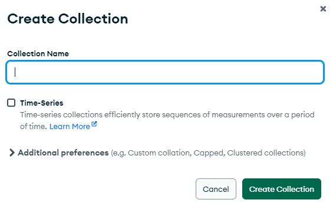
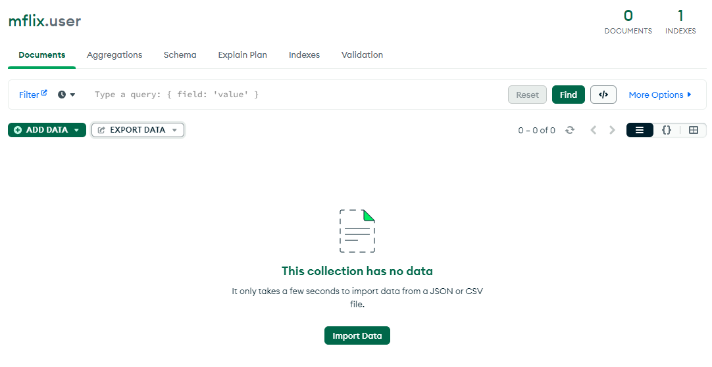
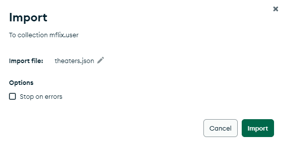
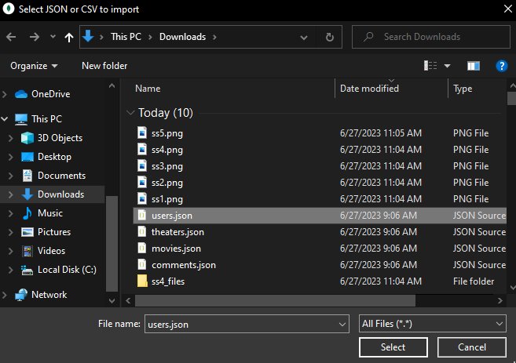
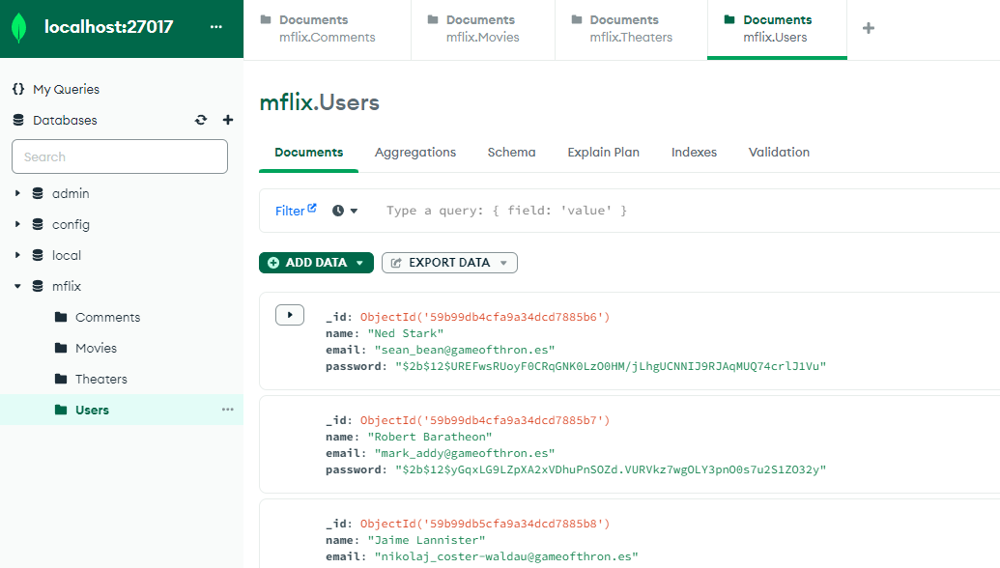

<a href="https://github.com/drshahizan/SECP3843/stargazers"></a>
<a href="https://github.com/drshahizan/SECP3843/network/members"></a>
<a href="https://github.com/drshahizan/SECP3843/pulls"></a>
<a href="https://github.com/drshahizan/SECP3843/issues"></a>
<a href="https://github.com/drshahizan/SECP3843/graphs/contributors"></a>


Don't forget to hit the :star: if you like this repo.

# Special Topic Data Engineering (SECP3843): Alternative Assessment

#### Name: Singthai Srisoi
#### Matric No.: A20EC0147
#### Dataset: Mflix Dataset

## Question 2 (a)
**Step 1: Create a Database in MongoDB Compass**

1. Launch MongoDB Compass and connect to your MongoDB server.
2. Click on the "New Connection" button or select "New Connection" from the "File" menu to create a new connection.
3. Fill in the necessary connection details, such as the hostname, port, authentication credentials (if required), and SSL options.
4. Click on the "Connect" button to establish the connection to the MongoDB server.
5. Once connected, you will see a list of databases on the left-hand side of the MongoDB Compass interface.
6. Click on the "+" icon next to "Databases" to create a new database.
7. Enter a name for the database and click on the "Create Database" button to create the database in MongoDB Compass.

**Explanation:** In this step, you are creating a new database in MongoDB Compass. The database will serve as a container for your imported data.

**Caution:** Ensure that you have the necessary permissions to create databases on the MongoDB server. If you are using a managed MongoDB service, make sure you have the appropriate access rights to create databases.


---

**Step 2: Import Data**

1. With the newly created database selected in MongoDB Compass, click on the "Collection" button or select "Collection" from the "File" menu to create a new collection within the database.
2. Enter a name for the collection and click on the "Create Collection" button to create the collection.
3. Select the newly created collection from the left-hand side panel.
4. Click on the "Add Data" button located in the collection view.
5. Choose the JSON option from the available data import options.

**Explanation:** In this step, you are creating a new collection within the database where you will import your JSON data.

**Caution:** Ensure that the database and collection names are unique and follow any naming conventions or guidelines you have in place.





---

**Step 3: Choose Data File**

1. In the JSON import dialog, click on the "Browse" button to select the JSON file you want to import.
2. Navigate to the directory where your JSON file is located, select the file, and click on the "Open" button.

**Explanation:** In this step, you are selecting the JSON file that contains the data you want to import into MongoDB.

**Caution:** Make sure you have the correct JSON file that contains the data you intend to import. Verify the file path and ensure that the file is accessible.



---

**Step 4: Check Data**

1. After selecting the JSON file, MongoDB Compass will display a preview of the imported data.
2. Review the preview to ensure that the data appears as expected and that it matches the structure of your JSON file.
3. Check for any errors or inconsistencies in the data preview.

**Explanation:** This step allows you to inspect the data before importing it into MongoDB to ensure its accuracy and completeness.

**Caution:** Pay close attention to any error messages or warnings displayed in the preview. If there are any issues with the data, you may need to address them before proceeding with the import.



## Question 2 (b)

We are using \_MONGOSH for the query. First we need to use the database first.
```javascript
use mflix
```


i. Create - 1 query:
To create a new document in the collection, you can use the `insertOne()` method. Here's an example query to create a new document in the "Users" collection:
```javascript
db.Users.insertOne({
  "name": "Sansa Stark",
  "email": "sansas@winterfell.com",
  "password": "$2b$12$Cv4zcmn70fW9X3GVoUqwm.w2On2qkSWQvkVuALrLMxPlKGzrZimX."
});
```
This query creates a new user document in the "Users" collection with the provided data.


ii. Read - 1 query:
To read documents from a collection, you can use the `find()` method. Here's an example query to retrieve all documents from the "Movies" collection:
```javascript
db.Movies.findOne({ title: "Blacksmith Scene" });
```


This query retrieves all documents from the "Movies" collection.

iii. Update - 2 queries:
To update documents in a collection, you can use the `updateOne()` method. Here are two example queries for updating documents:

Example 1: Update a movie's title:
```javascript
db.Movies.updateOne(
    { _id: ObjectId("573a1390f29313caabcd4135") }, 
    { $set: { title: "Yellowsmith Scene" } })
```
This query updates the title of a movie document with the provided ID.


Example 2: Add a new comment to a movie:
```javascript
db.mflix.Movies.updateOne(
   { _id: ObjectId("573a1390f29313caabcd4135") },
   { $push: { comments: { name: "John Doe", text: "This movie is great!" } } })
```


This query adds a new comment to the "comments" array field of a movie document.

iv. Delete - 1 query:
To delete a document from a collection, you can use the `deleteOne()` method. Here's an example query to delete a document from the "Theaters" collection:
```javascript
db.mflix.Movies.deleteOne({ _id: ObjectId("573a1390f29313caabcd4135") })
```


This query deletes a theater document with the provided ID from the "Movies" collection.

## Contribution 🛠️
Please create an [Issue](https://github.com/drshahizan/special-topic-data-engineering/issues) for any improvements, suggestions or errors in the content.

You can also contact me using [Linkedin](https://www.linkedin.com/in/drshahizan/) for any other queries or feedback.

[](https://visitorbadge.io/status?path=https%3A%2F%2Fgithub.com%2Fdrshahizan)


