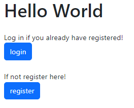
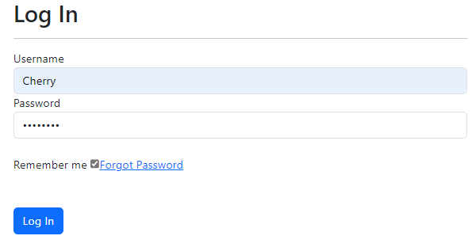
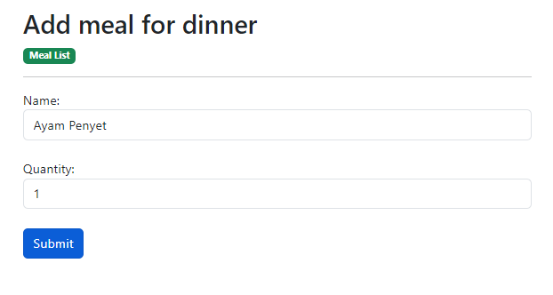
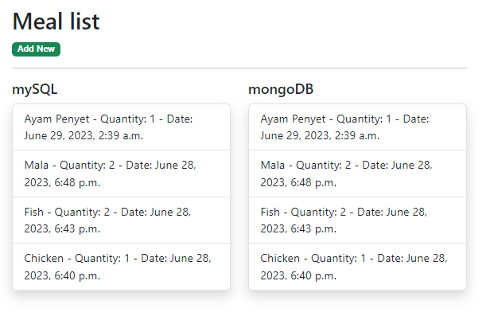

<a href="https://github.com/drshahizan/SECP3843/stargazers"></a>
<a href="https://github.com/drshahizan/SECP3843/network/members"></a>
<a href="https://github.com/drshahizan/SECP3843/pulls"></a>
<a href="https://github.com/drshahizan/SECP3843/issues"></a>
<a href="https://github.com/drshahizan/SECP3843/graphs/contributors"></a>


Don't forget to hit the :star: if you like this repo.

# Special Topic Data Engineering (SECP3843): Alternative Assessment

#### Name: Singthai Srisoi
#### Matric No.: A20EC0147
#### Dataset: Mflix Dataset

## Question 3 (a)
## Question 3

### Step 1: setup project

using command prompt start a django project and start an application.
```powershell
PS C:\Users\User\Desktop\django_project> django-admin startproject mflix
PS C:\Users\User\Desktop\django_project> cd mflix
PS C:\Users\User\Desktop\django_project\mflix> python manage.py startapp role
```

setup connection to mySQL
```python
DATABASES = {
    "default": {
        "ENGINE": "django.db.backends.mysql",
        "NAME": "mflix",
        "USER": "root",
        "PASSWORD": "",
        "HOST": "localhost",
        "PORT": "3306",
    }
}
```

go to `setting.py` add out app into the list.
```python
INSTALLED_APPS = [
    'django.contrib.admin',
    'django.contrib.auth',
    'django.contrib.contenttypes',
    'django.contrib.sessions',
    'django.contrib.messages',
    'django.contrib.staticfiles',
    'role.apps.RoleConfig', # new apps function
]
```

create model for different user, add attribute for the `AbstractUser` in `django.contrib.auth.models`.
```python
from django.db import models
from django.contrib.auth.models import AbstractUser

class User(AbstractUser):
    is_admin = models.BooleanField('Is admin', default=False)
    is_technical = models.BooleanField('Is technical worker', default=False)
    is_customer = models.BooleanField('Is customer', default=False)
    is_senior = models.BooleanField('Is senior manager', default=False)
```

make migration to database
```powershell
py manage.py makemigrations
py manage.py migrate
```

add urls
- in `urls.py` at `mflix` folder
```python
from django.contrib import admin
from django.urls import path, include

urlpatterns = [
    path('admin/', admin.site.urls),
    path('', include('role.urls')),
]
```
- add `urls.py` in role app
```python
from django.urls import path
from . import views

urlpatterns = [
    path('', views.index, name='index'),
]
```

create `forms.py`, declare input field for register and login
```python
from django import forms
from django.contrib.auth.forms import UserCreationForm
from .models import User

# create form for login
class LoginForm(forms.Form):
    # username input
    username = forms.CharField(
        widget=forms.TextInput(
            attrs={
                'class': 'form-control', 
                'placeholder': 'Username'
                }
            )
        )
    
    # password input
    password = forms.CharField(
        widget=forms.PasswordInput(
            attrs={
                'class': 'form-control', 
                'placeholder': 'Password'
                }
            )
        )

# create form for register
class RegisterForm(UserCreationForm):
    # username input
    username = forms.CharField(
        widget=forms.TextInput(
            attrs={
                'class': 'form-control', 
                'placeholder': 'Username'
                }
            )
        )
    
    # email input
    email = forms.CharField(
        widget=forms.TextInput(
            attrs={
                'class': 'form-control', 
                'placeholder': 'Email'
                }
            )
        )
    
    # password input
    password1 = forms.CharField(
        widget=forms.PasswordInput(
            attrs={
                'class': 'form-control', 
                'placeholder': 'Password'
                }
            )
        )
    
    # confirm password input
    password2 = forms.CharField(
        widget=forms.PasswordInput(
            attrs={
                'class': 'form-control', 
                'placeholder': 'Confirm Password'
                }
            )
        )
    
    # indicate with data model the register data model from
    class Meta:
        model = User
        fields = ('username', 'email', 'password1', 'password2', 'is_admin', 'is_technical', 'is_customer', 'is_senior')
```

create view function
```python
from django.shortcuts import render, redirect
from .forms import RegisterForm, LoginForm
from django.contrib.auth import authenticate, login, logout

# index landing page
def index(request):
    return render(request, 'index.html')

# register form
def register(request):
    msg = None
    if request.method == 'POST':
        form = RegisterForm(request.POST)
        if form.is_valid():
            user = form.save()
            msg = 'User created'
            return redirect('login_view')
        else:
            msg = 'Form is not valid'
    else:
        form = RegisterForm()
    return render(request, 'register.html', {'form': form, 'msg': msg})

# login form
def login_view(request):
    form = LoginForm(request.POST or None)
    msg = None
    if request.method == 'POST':
        if form.is_valid():
            # get username and password
            username = form.cleaned_data.get('username')
            password =  form.cleaned_data.get('password')
            user = authenticate(username=username, password=password)
            
            # redirect to home page after successful log in
            if user is not None:
                login(request, user)
                return redirect('home')
        else:
            msg = 'Form is not valid'
    else:
        form = LoginForm()
    return render(request, 'login.html', {'form': form, 'msg': msg})


def home(request):
    return render(request, 'home.html')
```

in app's `urls.py`, add path to the view
```python
from django.urls import path
from . import views

urlpatterns = [
    path('', views.index, name='index'),
    path('login/', views.login_view, name='login_view'),
    path('register/', views.register, name='register'),
    path('home/', views.home, name='home'),
]
```

create a new folder named `templates`. In `templates`, add `base.html` for the template of others page.
```html
<!DOCTYPE html>
<html lang="en">
<head>
    <meta charset="UTF-8">
    <title></title>
    <link href="https://cdn.jsdelivr.net/npm/bootstrap@5.3.0/dist/css/bootstrap.min.css" rel="stylesheet" integrity="sha384-9ndCyUaIbzAi2FUVXJi0CjmCapSmO7SnpJef0486qhLnuZ2cdeRhO02iuK6FUUVM" crossorigin="anonymous">
    <script src="https://cdn.jsdelivr.net/npm/bootstrap@5.3.0/dist/js/bootstrap.bundle.min.js" integrity="sha384-geWF76RCwLtnZ8qwWowPQNguL3RmwHVBC9FhGdlKrxdiJJigb/j/68SIy3Te4Bkz" crossorigin="anonymous"></script>
    <script src="https://cdn.jsdelivr.net/npm/@popperjs/core@2.11.8/dist/umd/popper.min.js" integrity="sha384-I7E8VVD/ismYTF4hNIPjVp/Zjvgyol6VFvRkX/vR+Vc4jQkC+hVqc2pM8ODewa9r" crossorigin="anonymous"></script>
    <script src="https://cdn.jsdelivr.net/npm/bootstrap@5.3.0/dist/js/bootstrap.min.js" integrity="sha384-fbbOQedDUMZZ5KreZpsbe1LCZPVmfTnH7ois6mU1QK+m14rQ1l2bGBq41eYeM/fS" crossorigin="anonymous"></script>
</head>
<body>
    <div class="container">
        
    </div>
</body>
</html>
```

create index page, login page, and register page
```html
<!-- index page -->


Landing Page


<div class="row justify-content-center">
    <div class="col-md-6 contents">
      <div class="row justify-content-center">
        <div class="col-md-12">
          <div class="form-block">
              <div class="mb-4">
                  <h1>Hello World</h1>
              </div>
              <label>Log in if you already have registered!</label>
              <div class="form-group last mb-4">
                  <a href="  " class="btn btn-primary">login</a>
              </div>
              <label>If not register here!</label>
              <div class="form-group last mb-4">
                  <a href="  " class="btn btn-primary">register</a>
              </div>
          </div>
        </div>
      </div>
    </div>
  </div>

```

```html
<!-- login page -->


Login Page


<div class="row justify-content-center">
    <div class="col-md-6 contents">
      <div class="row justify-content-center">
        <div class="col-md-12">
          <div class="form-block">
              <div class="mb-4">
                <h2>Log In</h2>
                <hr />
                <span class="mb-0 text-muted">
                  
                      {{ msg | safe }}
                  
                </span>
                  <form  method="post">
                      
                    <div class="form-group first">
                      <label for="username">Username</label>
                        {{ form.username }}
                    </div>
                    <div class="form-group last mb-4">
                      <label for="username">Password</label>
                      {{ form.password }}
                    </div>
  
                    <div class="d-flex mb-5 align-items-center">
                      <label class="control control--checkbox mb-0"><span class="caption">Remember me</span>
                        <input type="checkbox" checked="checked"/>
                        <div class="control__indicator"></div>
                      </label>
                      <span class="ml-auto"><a href="#" class="forgot-pass">Forgot Password</a></span>
                    </div>
  
                    <input type="submit" value="Log In" class="btn btn-pill text-white btn-block btn-primary">
                  </form>
          </div>
        </div>
      </div>

    </div>

  </div>

```

```html
<!-- register page -->


Register Page


<div class="row justify-content-center">
    <div class="col-md-6 contents">
      <div class="row justify-content-center">
        <div class="col-md-12">
          <div class="form-block">
            <h2>Register</h2>
                <hr />
            <span>
            
                {{ msg | safe }}
            
            </span>
            <form  method="post">
                
            <div class="form-group">
                <label for="username">Username</label>
                {{ form.username }}
            </div>
            <div class="form-group">
                <label for="email">Email</label>
                {{ form.email}}
            </div>
            <div class="form-group mb-4">
                <label for="password">Password</label>
                {{ form.password1 }}
            </div>
            <div class="form-group mb-4">
                <label for="password">Confirm Password</label>
                {{ form.password2 }}
            </div>

            <h4>User Type</h4>
            <!--
            <div class="d-flex align-items-center">
                <label class="control control--checkbox mb-0">
                    {{ form.is_admin }}
                    <span class="caption">Admin</span>
                    
                <div class="control__indicator"></div>
                </label>
            </div>
            -->
            <div class="d-flex align-items-center">
                <label class="control control--checkbox mb-0">
                    {{ form.is_customer }}
                    <span class="caption">Customer</span>
                    
                <div class="control__indicator"></div>
                </label>
            </div>
            <div class="d-flex align-items-center">
                <label class="control control--checkbox mb-0">
                    {{ form.is_technical }}
                    <span class="caption">Technical Worker</span>
                    
                <div class="control__indicator"></div>
                </label>
            </div>
            <div class="d-flex mb-5 align-items-center">
                <label class="control control--checkbox mb-0">
                    {{ form.is_senior }}
                    <span class="caption">Senior Management</span>
                    
                <div class="control__indicator"></div>
                </label>
            </div>
                <span class="text-error">{{ form.errors }}</span>
            <input type="submit"  value="Register" class="btn btn-primary">
            </form>
          </div>
        </div>
      </div>

    </div>

  </div>

```

For different type of user, redirect to different page. To do this, we need to check the user type on submit login form and redirect to the coresponding page. In the `view.py` the `login_view` function, add constraints to check user type and redirection.
```python
if form.is_valid():
    username = form.cleaned_data.get('username')
    password =  form.cleaned_data.get('password')
    user = authenticate(username=username, password=password)
    if user is not None and user.is_customer:
        login(request, user)
        return redirect('customer')
    elif user is not None and user.is_senior:
        login(request, user)
        return redirect('senior')
    elif user is not None and user.is_technical:
        login(request, user)
        return redirect('technical')
    elif user is not None and user.is_admin:
        login(request, user)
        return redirect('admin')
    else:
        msg = 'Form submission successful'
else:
    msg = 'Form is not valid'
```
create view function to render the page
```python
def customer(request):
    return render(request, 'customer.html')

def technical(request):
    return render(request, 'technical.html')

def senior(request):
    return render(request, 'senior.html')

def admin(request):
    return redirect('admin')
```

create pages in template for customer, technical worker and senior management.
```html
<!-- customer page -->


Home Page


<div class="row justify-content-center">
    <div class="col-md-6 contents">
      <div class="row justify-content-center">
        <div class="col-md-12">
          <div class="form-block">
              <div class="mb-4">
                  <h1>Hello {{ user.username }}</h1>
                  <h2>Dear, Customer</h2>
                  <a href="  " class="btn btn-info">Log out</a>
              </div>
          </div>
        </div>
      </div>

    </div>

  </div>

```

```html
<!-- senior management page -->


Home Page


<div class="row justify-content-center">
    <div class="col-md-6 contents">
      <div class="row justify-content-center">
        <div class="col-md-12">
          <div class="form-block">
              <div class="mb-4">
                  <h1>Hello {{ user.username }}</h1>
                  <h2>Dear, Senior Management</h2>
                  <a href="  " class="btn btn-info">Log out</a>
              </div>
          </div>
        </div>
      </div>

    </div>

  </div>

```

```html
<!-- technical worker page --->


Home Page


<div class="row justify-content-center">
    <div class="col-md-6 contents">
      <div class="row justify-content-center">
        <div class="col-md-12">
          <div class="form-block">
              <div class="mb-4">
                  <h1>Hello {{ user.username }}</h1>
                  <h2>Dear, Technical Worker</h2>
                  <a href="  " class="btn btn-info">Log out</a>
              </div>
          </div>
        </div>
      </div>

    </div>

  </div>

```

create log out function
```python
def logout_view(request):
    logout(request)
    return redirect('index')
```

add path to new page and function
```python
    path('admin/', admin, name='admin'),
    path('senior/', views.senior, name='senior'),
    path('technical/', views.technical, name='technical'),
    path('customer/', views.customer, name='customer'),
    path('logout/', views.logout_view, name='logout_view'),
```

Now the system can be login by three type of `user: ['customer', 'technical worker', 'senior management']` and each user will direct to the coresponding page after login.
The landing page:
- 

Register:

- 

user ccan choose their user type when register

Login into system:

- 

It will direct user to the coresponding user type page:

- 

## Question 3 (b)
The possible approach to solve data replication and synchronization between MySQL and MongoDB would be **database-level replication** and **application-level replication**. Ths is to ensure one databse are accurately reflect in the other. Thereby, it can maintain the data consistency across both system.

**Database-level replication** is when you replicate the entire database from one to another. This can ensure for simplicity and reliability, as well as ensuring data consistency in database level.

To implement this, in a Django project connect to both database in setting:
```python
DATABASES = {
    "default": {
        "ENGINE": "django.db.backends.mysql",
        "NAME": "dinner",
        "USER": "root",
        "PASSWORD": "",
        "HOST": "localhost",
        "PORT": "3306",
    },
    'mongodb': {
        'ENGINE': 'djongo',
        'ENFORCE_SCHEMA': False,
        'NAME': 'dinner',
        'CLIENT': {
            'host': 'localhost:27017',
            'port': 27017,
        },
    },
}
```

Create a model in the app:
```python
class Meal(models.Model):
    id = models.AutoField(primary_key=True)
    name = models.CharField(max_length=100)
    quantity = models.IntegerField()
    datetime = models.DateTimeField(auto_now_add=True)

    def __str__(self):
        return self.name
```

create a function that save data in both database:
```python
def saveObj(meal):
    meal.save()
    meal.save(using='mongodb')
```

create a form for adding the Meal data:
```python
class MealForm(forms.ModelForm):
    class Meta:
        model = Meal
        fields = ['name', 'quantity']
        widgets = {
            'name': forms.TextInput(attrs={'class': 'form-control', 'placeholder': 'Name'}),
            'quantity': forms.NumberInput(attrs={'class': 'form-control', 'placeholder': 'Quantity'}),
        }
```


```python
def index(request):
    if request.method == 'POST':
        form = MealForm(request.POST)
        if form.is_valid():
            name = form.cleaned_data['name']
            quantity = form.cleaned_data['quantity']
            meal = Meal(name=name, quantity=quantity)
            # save into both databases
            saveObj(meal)
            # redirect
            return redirect('index')
    else:
        form = MealForm()   
    context = {'form': form}
    return render(request, 'index.html', context)
```

```html
<!-- add meal form -->

Dinner

<h2>Add meal for dinner</h2>
<a class="badge bg-success link-offset-2 link-underline link-underline-opacity-0" href="  ">Meal List</a>
<hr>
<form method="post">
    
    {{ form.name.label }}: {{ form.name }}
    <br>
    {{ form.quantity.label }}: {{ form.quantity }}
    <br>
    <input type="submit" value="Submit" class="btn btn-primary">
</form>

```

at this point, the data will add to database via passing throught `saveObj()` method. By using this, it will synchronous both database by replicating the data.





## Contribution 🛠️
Please create an [Issue](https://github.com/drshahizan/special-topic-data-engineering/issues) for any improvements, suggestions or errors in the content.

You can also contact me using [Linkedin](https://www.linkedin.com/in/drshahizan/) for any other queries or feedback.

[](https://visitorbadge.io/status?path=https%3A%2F%2Fgithub.com%2Fdrshahizan)


