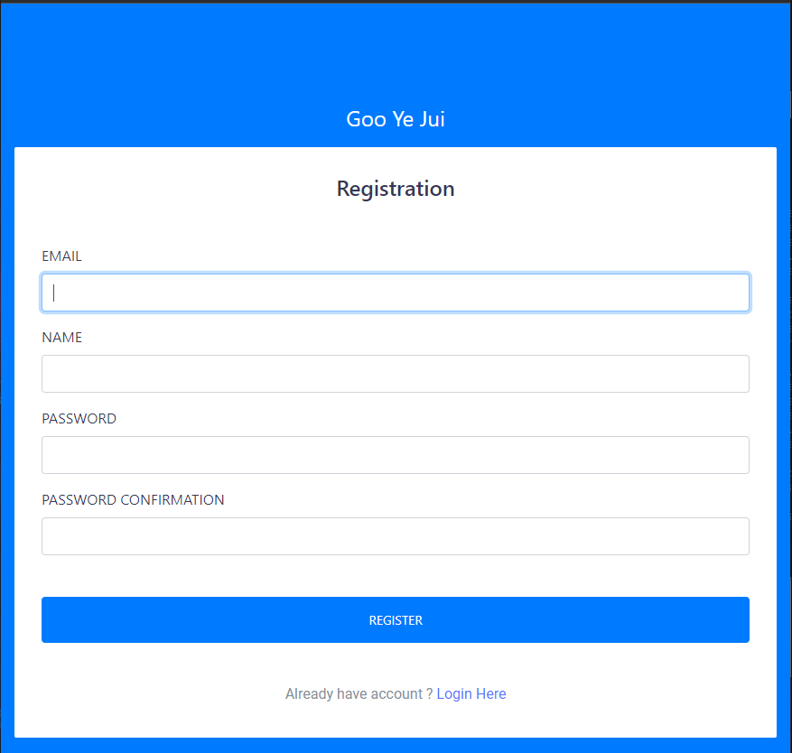
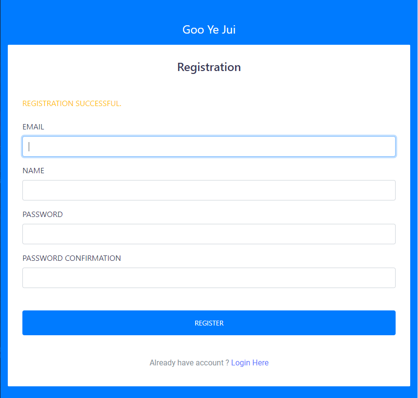
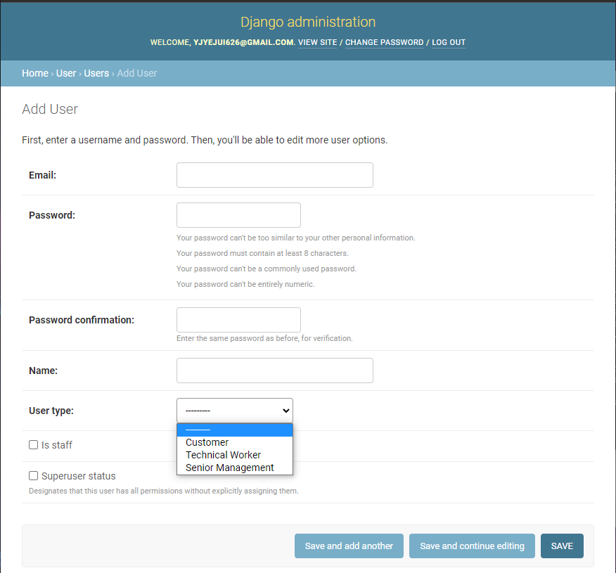
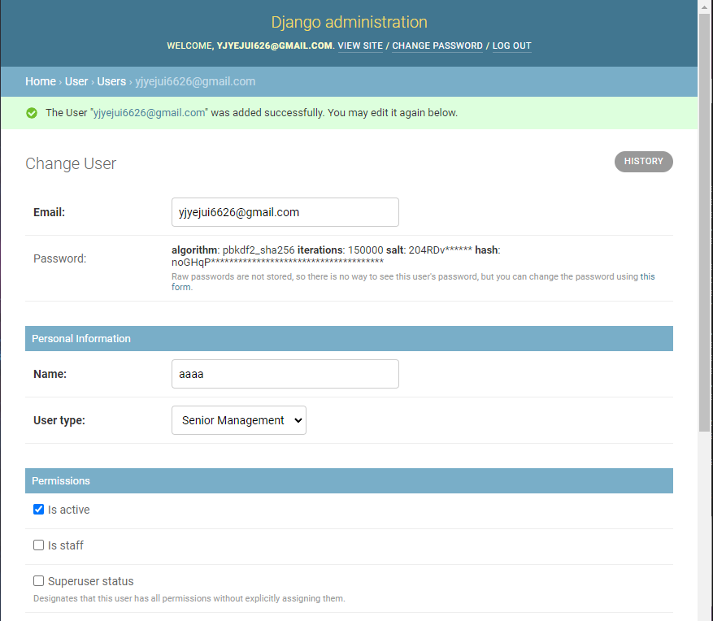
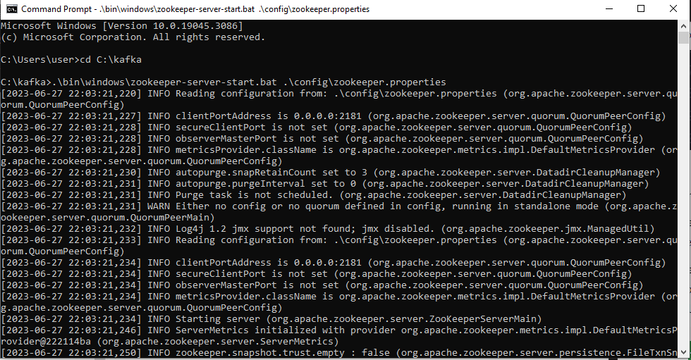
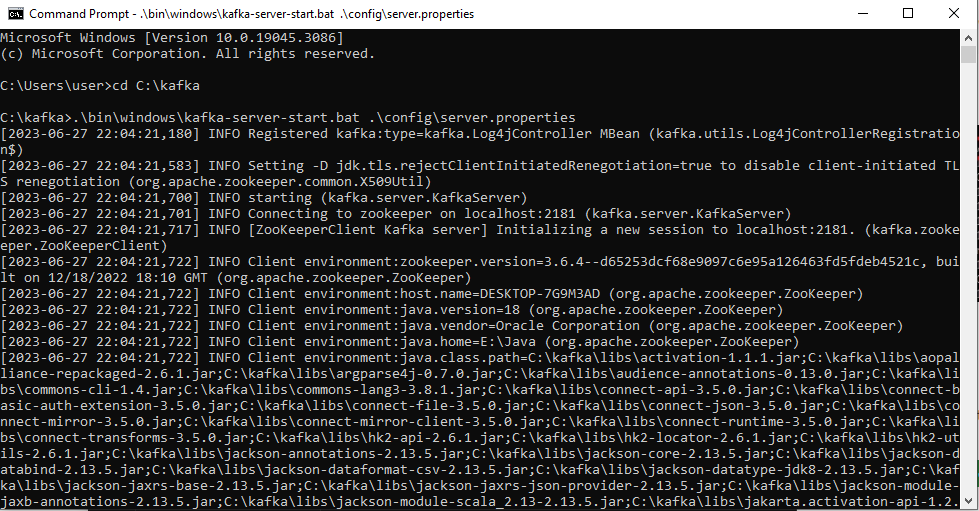

<a href="https://github.com/drshahizan/SECP3843/stargazers"></a>
<a href="https://github.com/drshahizan/SECP3843/network/members"></a>
<a href="https://github.com/drshahizan/SECP3843/pulls"></a>
<a href="https://github.com/drshahizan/SECP3843/issues"></a>
<a href="https://github.com/drshahizan/SECP3843/graphs/contributors"></a>


Don't forget to hit the :star: if you like this repo.

# Special Topic Data Engineering (SECP3843): Alternative Assessment

#### Name: GOO YE JUI  
#### Matric No.: A20EC0191
#### Dataset: Stories Dataset

## Question 3 (a)
To create a user registration and login module in Django using a MySQL database, these are the steps that I have done:

### Step 1 : Set up Django with MySQL
Make sure that `mysqlclient` is installed with the settings define in the project folder's `settings.py` as below:

```python
DATABASES = {
    'default': {
        'ENGINE': 'django.db.backends.mysql',
        'NAME': 'aa',
        'USER': 'root',
        'PASSWORD': '',
        'HOST': 'localhost',
        'PORT': 3306,
    },
}
```

### Step 2 : Defining User Model
A `User` model that inherit the `AbstractBaseUser` class provided by Django. The `user_type` have been declared with 3 different values to differentiate between Customer, Technical Worker and Senior Management.
```python
class UserManager(BaseUserManager):
    def _create_user(self, email, password, **extra_fields):
        if not email:
            raise ValueError("The Email field must be set")
        
        email = self.normalize_email(email)
        user = self.model(email=email, **extra_fields)
        user.set_password(password)
        user.save(using=self._db)
        return user
    
    def create_user(self, email, password, **extra_fields):
        """Create and save a regular User with the given email and password."""
        extra_fields.setdefault("is_staff", False)
        extra_fields.setdefault("is_superuser", False)
        return self._create_user(email, password, **extra_fields)
    
    def create_superuser(self, email, password, **extra_fields):
        extra_fields.setdefault('is_staff', True)
        extra_fields.setdefault('is_superuser', True)
        return self._create_user(email, password, **extra_fields)

class User(AbstractBaseUser,PermissionsMixin):
    USER_TYPE_CHOICES = (
        ('customer', 'Customer'),
        ('technical_worker', 'Technical Worker'),
        ('senior_management', 'Senior Management'),
    )

    email = models.EmailField(unique=True)
    name = models.CharField(max_length=255)  # Name field
    user_type = models.CharField(max_length=20, choices=USER_TYPE_CHOICES)
    is_active = models.BooleanField(default=True)
    is_staff = models.BooleanField(default=False)

    USERNAME_FIELD = 'email'
    REQUIRED_FIELDS = ['name','user_type']

    objects = UserManager()

    class Meta:
        verbose_name = 'User'
        app_label = 'user'
    
    def __str__(self):
        return self.email
```

Also, make sure thaat you have define `AUTH_USER_MODEL` as your `your_app_name.your_user_class_name`. In this case, mine is defined as below.


### Step 3 : Implementating Registration View and Templates
Under this user registration, user will only be registered under user type `Customer`. For Technical Worker and Senior Management registration, it can only be implemented under the admin class.

#### Views and Forms 
In the user app's `views.py` declare the function below as the register function.
```python
def register(request):
	if request.method == "POST":
		form = NewUserForm(request.POST)
		if form.is_valid():
			user = form.save()
			messages.success(request, "Registration successful." )
		else:
			messages.error(request, "Unsuccessful registration. Invalid information.")
	form = NewUserForm()
	return render (request=request, template_name="registration/register.html", context={"register_form":form})
```
As we can see from the register view, we can see that the function used `NewUserForm` to request POST data. In the user app's `forms.py` declare the `NewUserForm` class that inherits `UserCreationForm`. Inside the class, there is a function that save the user data into the database that can be called in the register function.

```python
class NewUserForm(UserCreationForm):
	email = forms.EmailField(required=True)

	class Meta:
		model = User
		fields = ("email","name","password1", "password2")

	def save(self, commit=True):
		user = super(NewUserForm, self).save(commit=False)
		user.email = self.cleaned_data['email']
		user.user_type = 'customer'
		if commit:
			user.save()
		return user
```

#### Templates
This is the template form that used to render the `NewUserForm`.
```python
                            <form method="POST">
                                
								
                                <div class="form-group">
								  <label for="{{ field.id_for_label }}">{{ field.label }}</label>
								  <div class="mb-3">
									{{field|addclass:'form-control'}}
								  </div>
								  <span class="text-danger">{{ field.errors }}</span>
                                </div>
								
                                <button type="submit" class="btn btn-primary btn-flat m-b-30 m-t-30">Register</button>
                                <div class="register-link m-t-15 text-center">
                                    <p>Already have account ? <a href=> Login Here</a></p>
                                </div>
                            </form>
```

#### Interface



### Step 4 : Implementating Login View and Templates

#### Views and Forms 
In the user app's `views.py` declare the function below as the user_login function.
```python
def user_login(request):
    form = LoginForm()  # Instantiate the LoginForm
    if request.method == 'POST':
        form = LoginForm(request.POST)  # Pass the POST data to the form
        if form.is_valid():
            email = form.cleaned_data.get("email")
            password = form.cleaned_data.get("password")
            user = authenticate(email=email, password=password)
            if user is not None:
                login(request, user)
                if user.user_type == 'customer':
                	return redirect('customer')
                elif user.user_type == 'technical_worker':
                	return redirect('technical_worker')
                elif user.user_type == 'senior_management':
                	return redirect('senior_management')
                else:
                      return redirect('index')
            else:
                messages.error(request, "Unsuccessful Login. Invalid information.")
                return render(request, 'registration/login.html', {'form': form})
        else:
            messages.error(request, "Form validation failed")
    return render(request, 'registration/login.html', {'form': form})
```
As we can see from the register view, we can see that the function used `LoginForm` to request POST data. In the user app's `forms.py` declare the `LoginForm` class that inherits `forms.Form`.

```python
class LoginForm(forms.Form):
    email = forms.EmailField()
    password = forms.CharField(widget=forms.PasswordInput)
```

#### Templates
This is the template form that used to render the `LoginForm`.
```python
                            <form action="" method="post">
                                <div class="form-group">
                                    <label>Email: </label>
                                    {{ form.email|addclass:'form-control'}}
                                </div>
                                <div class="form-group">
                                    <label>Password: </label>
                                    {{ form.password|addclass:'form-control'}}
                                </div>
                                
                                <input type="hidden" name="next" value="{{ next }}" />
                                <button type="submit" class="btn btn-primary btn-flat m-b-30 m-t-30">Sign in</button>
                                <div class="register-link m-t-15 text-center">
                                    <p>Don't have account ? <a href=> Sign Up Here</a></p>
                                </div>
                            </form>
```
#### Define the URLs
From the login view, user with different user_type is redirected to different urls, hence the urls is defined as below:
```python
urlpatterns = [
    path('', index, name='index'),
    path('customer/', customer, name='customer'),
    path('technical_worker/', technical_worker, name='technical_worker'),
    path('senior_management/', senior_management, name='senior_management'),
]
```

#### Interface
Login Page: <br>


Senior Management Redirection: <br>


Customer Redirection: <br>


Technical Worker Redirection: <br>


### Step 5 : Admin View (Registration)
To add manage the User class in Django Administration, a `CustomUserAdmin` class need to be declared inside `admin.py`
```python
class CustomUserAdmin(UserAdmin):
    list_display = ('email', 'name', 'user_type', 'is_active', 'is_staff')
    list_filter = ('is_active', 'is_staff', 'user_type')
    search_fields = ('email', 'name')
    ordering = ('email',)
    fieldsets = (
        (None, {'fields': ('email', 'password')}),
        ('Personal Information', {'fields': ('name', 'user_type')}),
        ('Permissions', {'fields': ('is_active', 'is_staff', 'is_superuser', 'groups', 'user_permissions')}),
        ('Important dates', {'fields': ('last_login',)}),
    )
    add_fieldsets = (
        (None, {
            'classes': ('wide',),
            'fields': ('email', 'password1', 'password2', 'name', 'user_type', 'is_staff', 'is_superuser'),
        }),
    )
admin.site.register(User, CustomUserAdmin)
```

#### Admin User Registration 





## Question 3 (b)



`kafka-topics.bat --create --topic story-events --bootstrap-server localhost:9092 --partitions 5 --replication-factor 1`

`pip install kafka-python`

`python manage.py send_to_kafka`

`python manage.py consume_and_save_to_mongodb`

## Contribution 🛠️
Please create an [Issue](https://github.com/drshahizan/special-topic-data-engineering/issues) for any improvements, suggestions or errors in the content.

You can also contact me using [Linkedin](https://www.linkedin.com/in/drshahizan/) for any other queries or feedback.

[](https://visitorbadge.io/status?path=https%3A%2F%2Fgithub.com%2Fdrshahizan)


